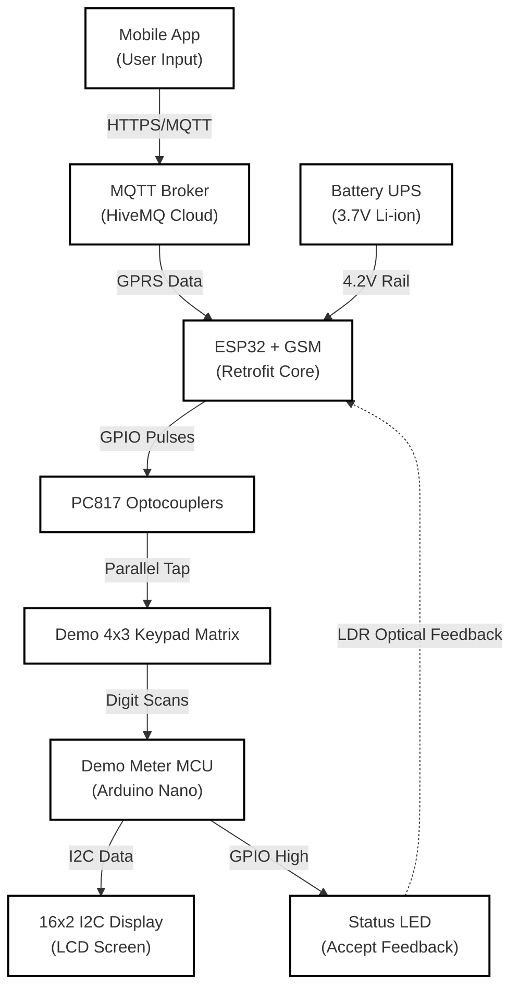

# demo-meter-design

```mermaid
graph TD
    App["Mobile App<br/>(User Input)"] -->|HTTPS/MQTT| MQTT["MQTT Broker<br/>(HiveMQ Cloud)"]
    MQTT -->|GPRS Data| ESP32["ESP32 + GSM<br/>(Retrofit Core)"]
    UPS["Battery UPS<br/>(3.7V Li-ion)"] -->|4.2V Rail| ESP32
    ESP32 -->|GPIO Pulses| Opto["PC817 Optocouplers"]

    Opto -->|Parallel Tap| Keypad["Demo 4x3 Keypad Matrix"]
    Keypad -->|Digit Scans| Nano["Demo Meter MCU<br/>(Arduino Nano)"]
    Nano -->|I2C Data| LCD["16x2 I2C Display<br/>(LCD Screen)"]
    Nano -->|GPIO High| LED["Status LED<br/>(Accept Feedback)"]

    LED -.->|LDR Optical Feedback| ESP32

    classDef default fill:#ffffff,stroke:#000000,stroke-width:2px;
```
